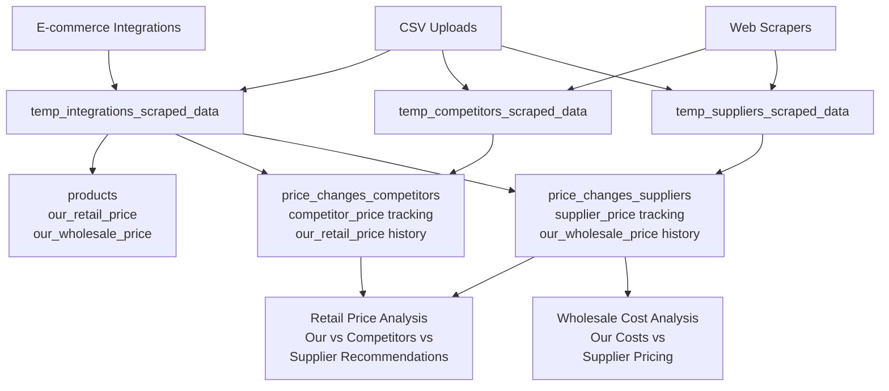

# PriceTracker SaaS Application

PriceTracker is a comprehensive SaaS platform designed to help businesses monitor competitor prices, manage supplier relationships, track product price changes across multiple sources, and gain actionable insights into market trends through automated web scraping, integrations, and advanced data analysis.

## 🚀 Core Features

### **Product Management**
-   **Multi-Type Product System**: Manage three distinct product types:
    - **Own Products**: Your retail inventory with pricing and wholesale costs
    - **Competitor Products**: Track competitor pricing and market positioning
    - **Supplier Products**: Monitor supplier costs and recommended retail prices
-   **Custom Fields**: Define unlimited custom fields per user (specifications, dimensions, descriptions, etc.)
-   **Automatic Field Detection**: AI-powered detection and creation of custom fields from scraped data
-   **Advanced Product Matching**: Fuzzy matching by EAN, SKU+Brand, and product names with user-configurable rules
-   **Brand Management**: Organize products by brands with alias support for variations

### **Price Tracking & Analysis**
-   **Historical Price Tracking**: Complete price history for all product types with percentage change calculations
-   **Multi-Currency Support**: Track prices in different currencies with proper formatting
-   **Price Comparison**: Compare your prices vs competitors vs supplier recommendations
-   **Automated Price Alerts**: Configurable thresholds for price change notifications

### **Data Import & Export**
-   **Enhanced CSV Upload**: Support for all product types with intelligent field mapping
-   **E-commerce Integrations**: Direct integration with platforms like PrestaShop
-   **Flexible Templates**: Dynamic CSV templates based on product type and custom fields
-   **Bulk Operations**: Import/export thousands of products with validation and error handling

### **Web Scraping & Automation**
-   **AI-Powered Scraper Generation**: Generate custom scrapers using AI for any website
-   **Multi-Language Support**: Python and TypeScript scraper support with Crawlee framework
-   **Automated Scheduling**: Set up recurring scraper runs with configurable intervals
-   **Worker Architecture**: Dedicated worker services for reliable, scalable scraping

### **Supplier Management**
-   **Supplier Database**: Comprehensive supplier information with contact details and automation settings
-   **Price Tracking**: Separate tracking for supplier costs and recommended retail prices
-   **Procurement Insights**: Compare wholesale costs across suppliers for better sourcing decisions
-   **Integration Ready**: Prepared for automated supplier data collection

### **User Experience**
-   **Authentication**: Secure sign-in using Google OAuth or email/password via NextAuth.js and Supabase Auth
-   **Dashboard**: Centralized overview with key metrics and recent activity
-   **Responsive Design**: Full mobile and desktop support with intuitive navigation
-   **Admin Panel**: User management, system monitoring, and configuration tools
-   **Settings**: Comprehensive user preferences, matching rules, and data management options

## 🏗️ System Architecture

### Data Flow Architecture

### Worker Architecture

PriceTracker uses a decoupled microservices architecture with separate worker services:

- **Web Service**: Next.js application handling UI, APIs, and user interactions
- **Python Worker**: Dedicated service for executing Python-based scrapers
- **TypeScript Worker**: Dedicated service for TypeScript/Crawlee scrapers
- **TypeScript Utility Worker**: Handles integrations, data processing, and utility tasks

**Benefits:**
- **Reliability**: Isolated failure domains prevent scraper issues from affecting the web app
- **Scalability**: Workers can be scaled independently based on workload
- **Performance**: Resource-intensive tasks don't impact user experience
- **Maintainability**: Clear separation of concerns and specialized services

For detailed architecture documentation, see [worker-architecture.md](./docs/architecture/worker-architecture.md).

## 🛠️ Technology Stack

### Frontend
- **Next.js 15**: React framework with App Router and Server Components
- **TypeScript**: Type-safe development with strict configuration
- **Tailwind CSS**: Utility-first CSS framework for responsive design
- **Shadcn/ui**: Modern component library built on Radix UI
- **NextAuth.js**: Authentication with Google OAuth and email/password

### Backend
- **Supabase**: PostgreSQL database with Row Level Security (RLS)
- **Next.js API Routes**: RESTful API endpoints with TypeScript
- **Database Functions**: PostgreSQL functions for complex data processing
- **Real-time Subscriptions**: Live updates for price changes and scraper status

### Workers & Automation
- **Python Workers**: Beautiful Soup, Requests, Selenium for web scraping
- **TypeScript Workers**: Crawlee framework for modern web scraping
- **Cron Jobs**: Automated scheduling for recurring scraper runs
- **Queue System**: Reliable job processing with failure handling

### Data Processing
- **Fuzzy Matching**: Advanced product matching algorithms
- **Custom Fields**: Dynamic schema with type validation
- **Price History**: Complete audit trail for all price changes
- **CSV Processing**: Intelligent parsing and validation

## 📊 Key Metrics & Capabilities

- **Multi-Tenant**: Supports hundreds of users with data isolation
- **Scalable**: Handles 10+ scrapers per user with automated scheduling
- **Performance**: Optimized database queries with proper indexing
- **Reliable**: Comprehensive error handling and retry mechanisms
- **Secure**: RLS policies, input validation, and secure authentication

## 🚀 Deployment

PriceTracker is designed for Railway deployment with four microservices:

1. **Main Web Service**: Next.js application with API routes
2. **Python Worker**: Dedicated Python scraper execution environment
3. **TypeScript Worker**: Modern scraping with Crawlee framework
4. **TypeScript Utility Worker**: Integration processing and utility tasks

**Deployment Features:**
- **Environment Isolation**: Separate staging and production environments
- **Auto-scaling**: Workers scale based on job queue length
- **Health Monitoring**: Comprehensive logging and error tracking
- **Database Migrations**: Automated schema updates and data migrations

For detailed deployment instructions, see [DEPLOYMENT.md](./docs/deployment/DEPLOYMENT.md).

## 📚 Documentation

- **[Enhanced Product Import System](./docs/future/enhanced-product-import-system-plan.md)**: Comprehensive product management features
- **[Custom Fields System](./docs/features/custom-fields-integration.md)**: User-defined fields with automatic detection
- **[Pricing Structure Plan](./docs/future/pricing-structure-refactoring-plan.md)**: Advanced price tracking architecture
- **[Worker Architecture](./docs/architecture/worker-architecture.md)**: Microservices design and implementation

## 🔄 Recent Major Updates

### ✅ Phase 1-3 Completed (Enhanced Product Import System)
- **Multi-Type Product Support**: Own, Competitor, and Supplier products
- **Custom Fields System**: User-defined fields with automatic detection
- **Supplier Management**: Complete supplier relationship management
- **Enhanced CSV Upload**: Intelligent field mapping and validation
- **Advanced Matching**: Fuzzy product matching with configurable rules

### 🚧 Upcoming Features
- **Pricing Structure Refactoring**: Clearer price tracking with separate tables
- **Advanced Analytics**: Procurement insights and margin analysis
- **API Enhancements**: RESTful API for third-party integrations
- **Mobile App**: Native mobile application for on-the-go monitoring

## 📄 License

This project is licensed under the MIT License.
