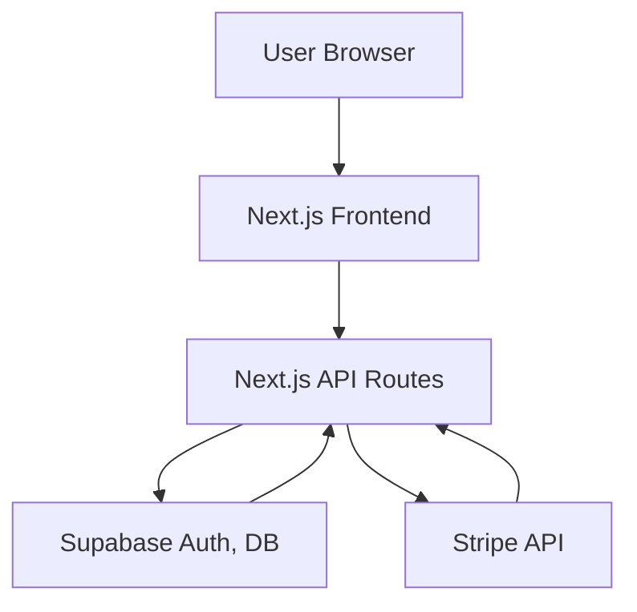

# PriceTracker SaaS Application

PriceTracker is a SaaS application that helps businesses monitor competitor prices, track price changes, and gain insights into market trends.

## Features

- **Authentication**: Sign in with Google or email/password
- **Dashboard**: Overview of competitors, products, and recent price changes
- **Competitors**: Manage competitor information
- **Products**: Track your products and compare prices
- **Scrapers**: AI-powered web scraping to automatically collect price data
- **Insights**: Analyze price trends and get actionable insights
- **Settings**: Configure API integrations and account settings
- **Admin**: Manage users and system settings

## Tech Stack

- **Frontend**: Next.js 14 with App Router, TypeScript, TailwindCSS
- **Backend**: Next.js API Routes, Supabase
- **Authentication**: NextAuth.js with Google OAuth, Supabase Auth
- **Database**: Supabase (PostgreSQL)
- **Payments**: Stripe
- **Architecture**: Vertical Slice Architecture

## System Architecture


```mermaid
graph TD
    A[User Browser] --> B[Next.js Frontend]
    B --> C[Next.js API Routes]
    C --> D[Supabase Auth, DB]
    C --> E[Stripe API]
    D --> C
    E --> C
```

## Getting Started

### Prerequisites

- Node.js 18+ and npm
- Supabase account
- Google OAuth credentials
- Stripe account

### Environment Variables

Create a `.env.local` file with the following variables:

```
# Supabase
NEXT_PUBLIC_SUPABASE_URL=your_supabase_url
NEXT_PUBLIC_SUPABASE_ANON_KEY=your_supabase_anon_key
SUPABASE_SERVICE_ROLE_KEY=your_supabase_service_role_key

# NextAuth
NEXTAUTH_SECRET=your_nextauth_secret
NEXTAUTH_URL=http://localhost:3000

# NextAuth Google Provider
GOOGLE_CLIENT_ID=your_google_client_id
GOOGLE_CLIENT_SECRET=your_google_client_secret

# Stripe
STRIPE_SECRET_KEY=your_stripe_secret_key
NEXT_PUBLIC_STRIPE_PUBLISHABLE_KEY=your_stripe_publishable_key
STRIPE_WEBHOOK_SECRET=your_stripe_webhook_secret
```

### Database Setup

1. Follow the instructions in `scripts/README.md` to set up the database tables in Supabase.
2. This will run the `complete-setup.sql` script which creates all necessary tables, functions, triggers, and sample data.

### Installation

```bash
# Install dependencies
npm install

# Run the development server
npm run dev
```

Open [http://localhost:3000](http://localhost:3000) in your browser to see the application.

## Project Structure

The project has been restructured to use a more modular approach, with services and components organized by feature.

```
src/
├── app/                    # Next.js App Router
│   ├── (app)/              # Authenticated application routes
│   ├── (auth)/             # Authentication routes
│   ├── (marketing)/        # Public/marketing pages
│   ├── admin/              # Admin section
│   ├── api/                # API routes
│   └── layout.tsx          # Root layout
├── components/             # UI components organized by feature
│   ├── layout/             # Layout components
│   ├── products/           # Product-related components
│   ├── providers/          # Context providers
│   ├── scrapers/           # Scraper-related components
│   └── ui/                 # Shared UI components
├── lib/                    # Shared libraries and services
│   ├── auth/               # Authentication utilities
│   ├── db/                 # Database utilities
│   ├── services/           # Business logic services
│   │   ├── product-service.ts       # Product-related services
│   │   ├── product-client-service.ts # Client-side product services
│   │   ├── scraper-service.ts       # Scraper-related services
│   │   └── scraper-client-service.ts # Client-side scraper services
│   ├── stripe/             # Stripe integration
│   ├── supabase/           # Supabase clients
│   └── utils.ts            # Utility functions
```

## Development

### Adding a New Feature

1. Create appropriate components in `src/components/[feature-name]/`
2. Add business logic in `src/lib/services/`
3. Add API routes in `src/app/api/` if needed
4. Add pages in `src/app/(app)/` or appropriate route group

### Version Control

The project includes a `.gitignore` file that excludes the following from version control:

- `node_modules/` - Dependencies that can be installed with npm
- `.next/` - Next.js build output
- `.env*.local` - Environment variables containing sensitive information
- `*.tsbuildinfo` - TypeScript incremental build information
- Various log files and system-specific files

If you need to make changes to the `.gitignore` file, ensure you don't accidentally commit sensitive information or large build artifacts.

### Database Changes

When you need to make changes to the database schema:

1. Make a backup of your current database if it contains important data
2. Modify the `scripts/complete-setup.sql` file to include your changes
3. Run the updated SQL in the Supabase SQL Editor
4. For complex changes, consider creating separate migration scripts in a `scripts/migrations/` directory

## Deployment

### Vercel Deployment

1. Push your code to a GitHub repository
2. Create a new project in Vercel
3. Connect your GitHub repository
4. Add the environment variables
5. Deploy

### Supabase Setup for Production

1. Create a new Supabase project for production
2. Run the database setup script
3. Update the environment variables in your deployment

## License

This project is licensed under the MIT License - see the LICENSE file for details.
