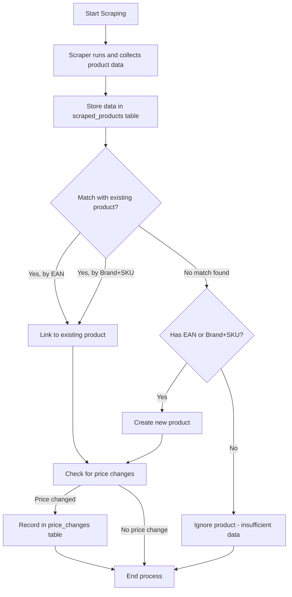
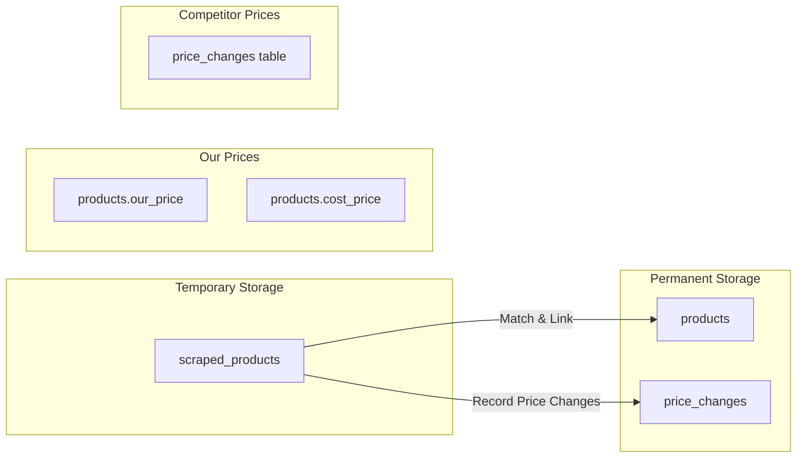
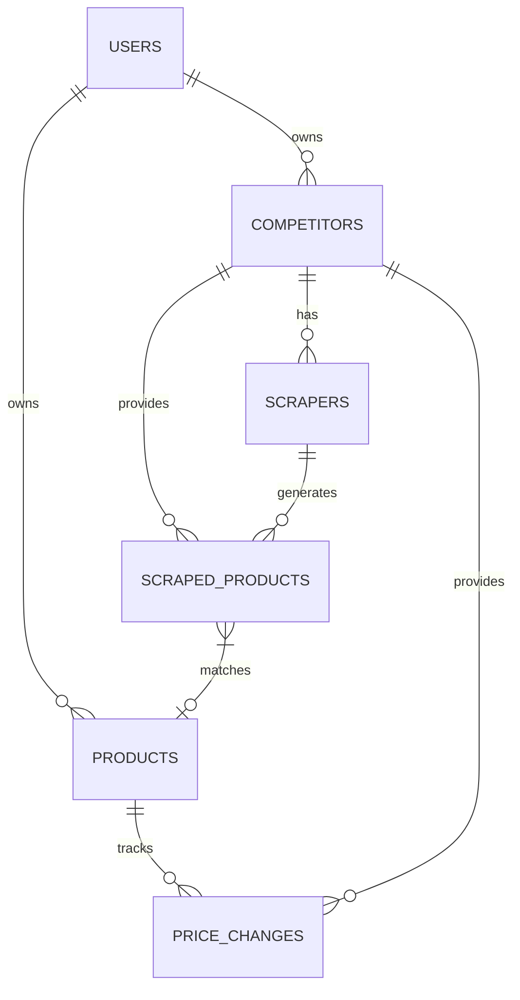

# PriceTracker Scraping Process

## Product Scraping and Matching Flow



## Data Storage Strategy



## Database Relationships



## Product Matching Logic

```mermaid
flowchart TD
    A[New scraped product] --> B{Has EAN?}
    B -->|Yes| C[Search for product with matching EAN]
    B -->|No| F{Has Brand and SKU?}
    
    C --> D{Match found?}
    D -->|Yes| E[Link to existing product]
    D -->|No| F
    
    F -->|Yes| G[Search for product with matching Brand+SKU]
    F -->|No| N[Ignore product - insufficient data]
    
    G --> H{Match found?}
    H -->|Yes| I[Link to existing product]
    H -->|No| J[Create new product]
    
    E --> K[Check for price changes]
    I --> K
    J --> K
    N --> M[End process]
    
    K -->|Price changed| L[Record in price_changes table]
    K -->|No change| M
    L --> M