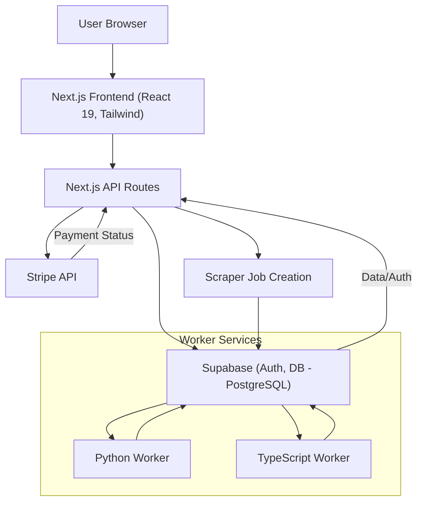
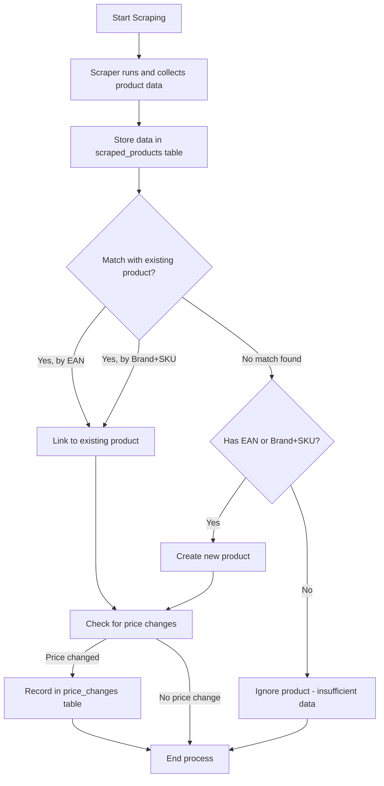
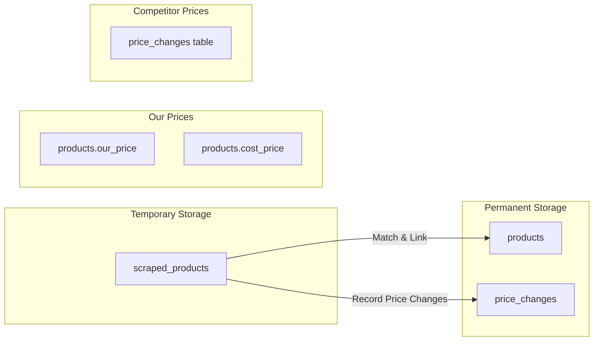
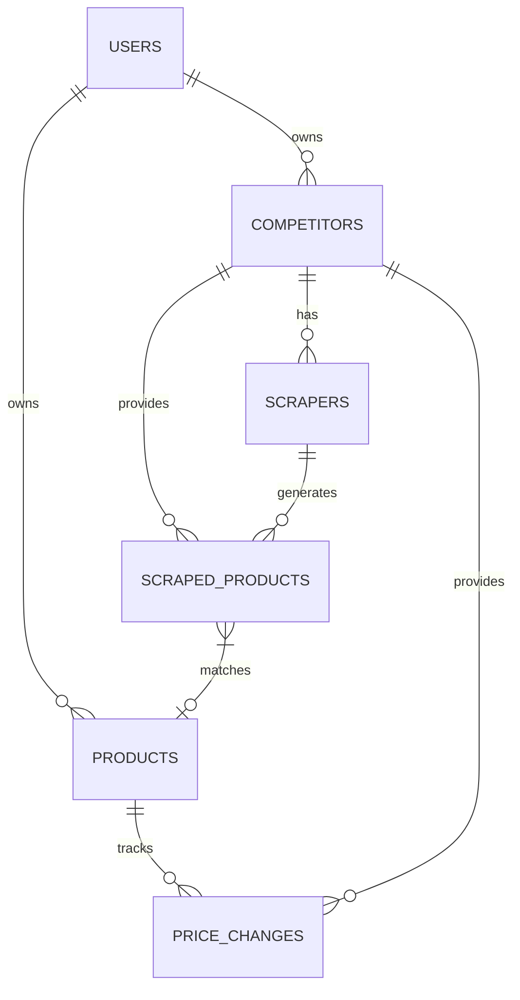
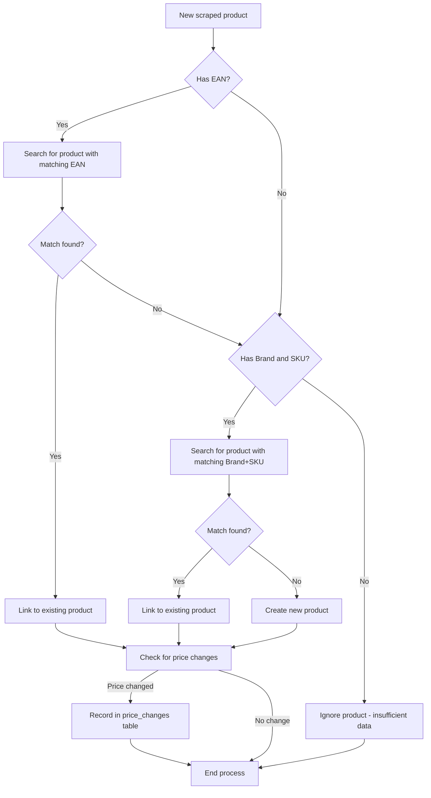

# PriceTracker Planning Document

**Purpose:** High-level vision, architecture, constraints, tech stack, tools, etc. To be referenced by AI assistants using the prompt: “Use the structure and decisions outlined in PLANNING.md.”

## 1. Project Overview

PriceTracker is a SaaS application designed to help businesses monitor competitor prices, track product price changes across various sources, and gain insights into market trends through automated web scraping and data analysis.

## 2. Core Features

-   **Authentication**: Secure sign-in using Google OAuth or traditional email/password via NextAuth.js and Supabase Auth.
-   **Dashboard**: Centralized overview of tracked products, competitors, and recent price fluctuations.
-   **Competitors**: Manage and organize information about competitors.
-   **Products**: Track your own products, link them to competitor equivalents, and compare prices.
-   **CSV Management**: Download CSV templates for bulk product uploads and upload product data via CSV files.
-   **Scrapers**:
    -   AI-powered generation of web scrapers.
    -   Support for custom Python scrapers.
    -   Automated execution and scheduling of scrapers.
    -   Detailed run history, logs, and performance tracking (Products/sec).
    -   Testing and validation capabilities for scrapers.
    -   Activation and approval workflows for scrapers.
-   **Product Linking**: Associate your products with specific scrapers and competitor entries.
-   **Price History**: View historical price data for tracked products.
-   **Insights**: Analyze price trends and derive actionable market insights (future capability).
-   **Settings**: Configure account settings and potential third-party integrations.
-   **Admin**: User management and system-level configuration.

## 3. Tech Stack

-   **Framework**: Next.js 15.2.4 (App Router)
-   **Language**: TypeScript
-   **Styling**: Tailwind CSS 4, shadcn/ui (via `components.json`), Tailwind Merge, clsx, Tailwind CSS Animate
-   **UI Components**: Radix UI Primitives, Lucide Icons
-   **Backend**: Next.js API Routes
-   **Authentication**: NextAuth.js (v4) with Supabase Adapter, Google Provider
-   **Database**: Supabase (PostgreSQL)
-   **Payments**: Stripe (Integration via `stripe-js` and backend library)
-   **State Management**: React Context API (via Providers)
-   **Linting/Formatting**: ESLint 9
-   **Architecture**: Feature-based organization (similar to Vertical Slices)

## 4. System Architecture

### 4.1. Overall System Diagram



### 4.2. Scraping Process Flow



### 4.3. Data Storage Strategy



### 4.4. Database Relationships



## 5. Scalability Considerations

The current implementation uses separate worker services (Python and TypeScript) that poll the database for pending scraper jobs. This architecture provides better scalability and reliability compared to executing scrapers directly in API routes.

For deployment, the plan is to use **Railway** with three separate services:
1. **Main Web Service**: The Next.js application
2. **Python Worker**: For executing Python scrapers
3. **TypeScript Worker**: For executing TypeScript scrapers

This separation allows for independent scaling and resource allocation based on the needs of each component.

See details in:
-   `docs/architecture/worker-architecture.md`

## 6. Project Structure

```
pricetracker/
├── .env.local              # Local environment variables (ignored by git)
├── .gitignore              # Specifies intentionally untracked files
├── components.json         # shadcn/ui configuration
├── next.config.ts          # Next.js configuration
├── package.json            # Project dependencies and scripts
├── README.md               # Main project readme
├── PLANNING.md             # This file
├── TASK.md                 # Task tracking file
├── tailwind.config.ts      # Tailwind CSS configuration
├── tsconfig.json           # TypeScript configuration
├── public/                 # Static assets
│   └── ...
├── scripts/                # Database setup and migration scripts
│   ├── database-README.md
│   ├── database-setup.sql
│   └── migration-*.sql
├── src/
│   ├── app/                # Next.js App Router pages and layouts
│   │   ├── app-routes/     # Authenticated application routes (e.g., dashboard)
│   │   ├── auth-routes/    # Authentication routes (e.g., login, signup)
│   │   ├── marketing-routes/ # Public/marketing pages (e.g., landing page)
│   │   ├── admin/          # Admin-specific routes
│   │   ├── api/            # API route handlers organized by feature
│   │   │   ├── auth/
│   │   │   ├── competitors/
│   │   │   ├── products/
│   │   │   ├── scrapers/
│   │   │   └── webhooks/
│   │   ├── favicon.ico
│   │   ├── globals.css     # Global styles
│   │   └── layout.tsx      # Root application layout
│   ├── components/         # React components organized by feature/UI
│   │   ├── layout/         # Page layout components (header, sidebar, etc.)
│   │   ├── products/       # Components related to product features
│   │   ├── providers/      # React Context providers (e.g., AuthProvider)
│   │   ├── scrapers/       # Components related to scraper features
│   │   └── ui/             # Generic UI components (Button, Dialog, Table - often from shadcn/ui)
│   ├── lib/                # Shared libraries, utilities, and services
│   │   ├── auth/           # Authentication configuration and utilities (NextAuth options, adapter)
│   │   ├── db/             # Database related utilities (if any beyond Supabase client)
│   │   ├── services/       # Business logic services, organized by feature
│   │   │   ├── product-client-service.ts
│   │   │   ├── product-service.ts
│   │   │   ├── scraper-ai-service.ts
│   │   │   ├── scraper-client-service.ts
│   │   │   ├── scraper-creation-service.ts
│   │   │   ├── scraper-crud-service.ts
│   │   │   ├── scraper-execution-service.ts
│   │   │   ├── scraper-management-service.ts
│   │   │   ├── scraper-service.ts
│   │   │   └── scraper-types.ts
│   │   ├── stripe/         # Stripe client and server utilities
│   │   ├── supabase/       # Supabase client and server initializers
│   │   └── utils/          # General utility functions (e.g., cn, date formatting)
│   └── workers/            # Worker services for executing scrapers
│       ├── py-worker/      # Python worker for executing Python scrapers
│       │   ├── main.py     # Main Python worker script
│       │   └── requirements.txt # Python dependencies
│       └── ts-worker/      # TypeScript worker for executing TypeScript scrapers
│           ├── src/        # TypeScript worker source code
│           ├── dist/       # Compiled TypeScript worker
│           ├── package.json # TypeScript worker dependencies
│           └── tsconfig.json # TypeScript configuration
└── ...                     # Other config files (ESLint, PostCSS, etc.)
```

## 7. Development Process

### 7.1. Adding a New Feature

1.  **Components**: Create feature-specific components under `src/components/[feature-name]/`. Use shared UI components from `src/components/ui/`.
2.  **Services**: Implement business logic within new or existing services in `src/lib/services/`. Define necessary types (e.g., in `scraper-types.ts` or a new `[feature]-types.ts`).
3.  **API Routes**: If backend interaction is needed, add API routes under `src/app/api/[feature-name]/`. Use services to handle logic. Follow these API route naming conventions:
    - Use RESTful naming patterns (e.g., `/api/products/create` for creating products)
    - For operations on specific resources, use the pattern `/api/[resource]/[id]/[operation]` (e.g., `/api/scrapers/[scraperId]/run-test`)
    - Use consistent naming across similar operations (e.g., `run-test`, `run-full`, `run-history` for scraper operations)
4.  **Pages**: Create new pages/routes within the appropriate group in `src/app/` (e.g., `app-routes`, `auth-routes`). Fetch data using Server Components or client-side calls to API routes. Ensure client-side route names match their corresponding API routes for consistency.
5.  **Database**: If schema changes are required, update `scripts/database-setup.sql` or create a new migration script (`scripts/migration-XXX.sql`) and update `database-README.md`.

### 7.2. Database Changes

Follow the process outlined in `scripts/database-README.md`. Generally:
1.  Backup existing data if necessary.
2.  Modify `database-setup.sql` for initial setup changes or create a new `migration-XXX.sql` script for incremental changes.
3.  Apply the SQL script(s) to your Supabase instance via the SQL Editor.
4.  Test thoroughly.

### 7.3. Code Standardization and Best Practices

1. **Utility Functions**: Use centralized utility functions instead of duplicating code. For example, use `ensureUUID` from `@/lib/utils/uuid` instead of defining it in multiple files.

2. **API Route Naming**: Follow consistent naming conventions for API routes:
   - Use RESTful patterns (e.g., `/api/products/create` for creating products)
   - Use consistent operation names across similar features (e.g., `run-test`, `run-full`)
   - Match client-side route names with their corresponding API routes

3. **Code Organization**:
   - Keep related functionality together in the same service
   - Avoid circular dependencies between services
   - Use feature-based organization for components and services

4. **Error Handling**:
   - Use consistent error handling patterns across the codebase
   - Log errors with appropriate context
   - Return meaningful error messages to the client

5. **Cleanup**:
   - Remove deprecated or unused code
   - Don't leave commented-out code in production
   - Keep the codebase clean and maintainable

## 8. Setup & Installation

### 8.1. Prerequisites

-   Node.js 20+ and npm (as indicated by `@types/node: ^20`)
-   Supabase account and project setup
-   Google OAuth credentials configured in Supabase Auth
-   Stripe account and API keys

### 8.2. Environment Variables

Create a `.env.local` file in the project root with the following variables:

```
# Supabase
NEXT_PUBLIC_SUPABASE_URL=your_supabase_url
NEXT_PUBLIC_SUPABASE_ANON_KEY=your_supabase_anon_key
SUPABASE_SERVICE_ROLE_KEY=your_supabase_service_role_key # For backend operations

# NextAuth
NEXTAUTH_SECRET=generate_a_strong_secret # openssl rand -base64 32
NEXTAUTH_URL=http://localhost:3000 # Or your deployment URL

# Google OAuth (for NextAuth)
GOOGLE_CLIENT_ID=your_client_id
GOOGLE_CLIENT_SECRET=your_secret_url

# Stripe
STRIPE_SECRET_KEY=your_stripe_secret_key
NEXT_PUBLIC_STRIPE_PUBLISHABLE_KEY=your_stripe_publishable_key
STRIPE_WEBHOOK_SECRET=your_stripe_webhook_secret # For handling Stripe events
```

### 8.3. Database Setup

1.  Navigate to the `scripts/` directory.
2.  Review the `database-README.md` for detailed instructions.
3.  Execute the SQL commands in `database-setup.sql` against your Supabase project's SQL Editor. This script creates the necessary tables, functions, and triggers.
4.  Apply any subsequent migration scripts found in the `scripts/` directory (e.g., `migration-001-scraper-runs-enhancements.sql`) in order.

### 8.4. Installation

```bash
# Install dependencies
npm install

# Run the development server
npm run dev

# Or run with Turbopack (experimental)
npm run dev:turbo

# Build for production
npm run build

# Start production server
npm run start

# Lint the code
npm run lint
```

Open [http://localhost:3000](http://localhost:3000) in your browser to see the application.

## 9. Deployment

### 9.1. Railway (Planned Deployment)

The application is planned to be deployed on Railway with three separate services:

1. **Main Web Service**:
   - Repository: Your Git repo
   - Build Command: `npm run build:next`
   - Start Command: `npm start`

2. **Python Worker Service**:
   - Repository: Your Git repo (same as Web Service)
   - Working Directory: `pricetracker/src/workers/py-worker`
   - Start Command: `python main.py`

3. **TypeScript Worker Service**:
   - Repository: Your Git repo (same as Web Service)
   - Working Directory: `pricetracker/src/workers/ts-worker`
   - Build Command: `npm run build`
   - Start Command: `npm run start`

Each service should have the same environment variables configured, particularly the Supabase connection details.

### 9.2. Supabase Setup for Production

1.  Create a dedicated Supabase project for your production environment.
2.  Run the database setup and migration scripts (`scripts/*.sql`) against the production Supabase project.
3.  Ensure Row Level Security (RLS) is enabled and properly configured for all tables containing sensitive data.
4.  Use the production Supabase URL and keys in your Railway environment variables for all three services.

## 10. Core Concepts

### 10.1. Product Matching Logic



### 10.2. Price Storage Strategy

-   **Our Current Prices**: Store in the `products` table using the existing `our_price` and `cost_price` fields.
-   **Competitor Prices**: Store in the `price_changes` table, with entries only created when prices actually change.
-   **Our Price History**: For future implementation, we could either:
    -   Add our own price changes to the `price_changes` table with a special competitor_id.
    -   Create a separate table if we need different tracking logic for our prices.

### 10.3. Python Scraper Guidelines

The guide (to be created in `TASK.md`) will include:
1.  Database Schema Overview
2.  Scraper Development Guidelines
3.  Testing and Debugging
4.  Security Requirements
5.  Deployment Process