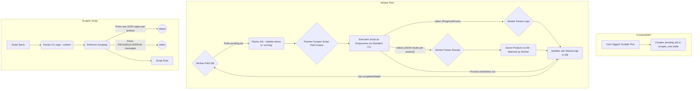

# Worker Architecture for Scraper Execution

## Current Architecture

PriceTracker uses a decoupled architecture with separate worker services for executing scrapers. This approach improves reliability, scalability, and maintainability by separating the web application from the resource-intensive scraping tasks.

### Overview

### Components

1. **Web Service (Next.js App)**
   - Handles the user interface and API requests
   - When a scraper run is triggered, it creates a record in the `scraper_runs` table with a status of 'pending'
   - Returns a response with the run ID immediately, without waiting for the scraper to complete

2. **Worker Services**
   - **TypeScript Worker** (`pricetracker\src\workers\ts-worker`)
     - Handles TypeScript scraper execution
     - Polls the database for pending jobs of type 'typescript'
     - Executes TypeScript scrapers as subprocesses
   
   - **Python Worker** (`pricetracker\src\workers\py-worker`)
     - Handles Python scraper execution
     - Polls the database for pending jobs of type 'python'
     - Executes Python scrapers as subprocesses

3. **Scraper Scripts**
   - Standardized command-line interface for both Python and TypeScript scrapers
   - Scripts output one JSON object per product to stdout
   - Progress and error messages are sent to stderr with 'PROGRESS:' or 'ERROR:' prefixes

### Execution Flow

1. **Job Creation**
   - User triggers a scraper run through the UI
   - API creates a 'pending' job in the `scraper_runs` table
   - Response is returned to the user immediately

2. **Job Claiming**
   - Workers continuously poll the database for pending jobs of their type
   - When a job is found, the worker claims it by updating its status to 'running'

3. **Script Execution**
   - Worker fetches the script content from the database
   - Creates a temporary file with the script content
   - Executes the script as a subprocess with appropriate context parameters
   - Monitors stdout for product data and stderr for progress/error messages

4. **Data Processing**
   - Products from stdout are parsed and saved to the database in batches
   - Progress/error messages from stderr are logged to the database
   - Job status is updated based on the script's exit code

5. **Completion**
   - When the script completes, the worker updates the job status to 'completed' or 'failed'
   - Final statistics (execution time, product count, etc.) are recorded

### Standardized CLI Interface

Both Python and TypeScript scrapers follow the same command-line interface:

- **Metadata Command**: `python <script_path> metadata` or `node <script_path> metadata`
  - Returns a JSON object with scraper metadata

- **Scrape Command**: `python <script_path> scrape --context='<json_string>'` or `node <script_path> scrape --context='<json_string>'`
  - `--context`: JSON string with runtime information (user_id, competitor_id, etc.)
  - Outputs one JSON object per product to stdout
  - Outputs progress/error messages to stderr with 'PROGRESS:' or 'ERROR:' prefixes

### Benefits of This Architecture

1. **Reliability**: Long-running scraper tasks don't affect the web service
2. **Scalability**: Workers can be scaled independently of the web service
3. **Simplicity**: Standardized interface makes it easy to create and maintain scrapers
4. **Robustness**: Subprocess execution provides isolation and prevents crashes
5. **Flexibility**: Different worker types can handle different scraper languages

## Future Deployment

The plan is to deploy the application on Railway with three separate services:

1. **Main Web Service**: The Next.js application
2. **Python Worker**: For executing Python scrapers
3. **TypeScript Worker**: For executing TypeScript scrapers

This separation allows for independent scaling and resource allocation based on the needs of each component.
