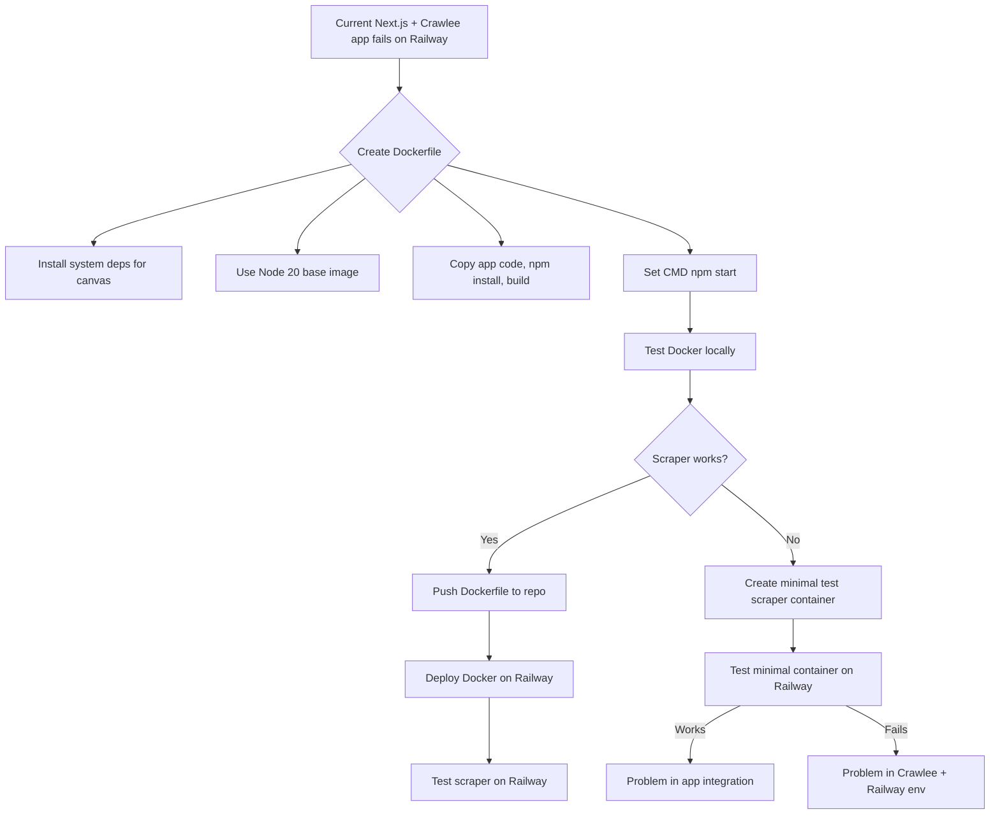

# Docker Migration Plan for Pricetracker on Railway

## Context

The Pricetracker app currently fails to run Crawlee scrapers on Railway's default Node.js environment due to:

- `TypeError: Cannot read properties of undefined (reading 'bind')` during Crawlee storage initialization.
- Hanging behavior on subsequent runs.
- Explicit MemoryStorage configuration does **not** resolve the issue.
- Likely root cause: missing native dependencies or environment incompatibility.

## Solution

**Containerize the entire app with Docker** to control the environment fully, including all system dependencies.

---

## Step-by-step Plan

### 1. Create a Dockerfile

- **Base image:** Use an official Node.js 20 image, e.g., `node:20-slim`.
- **Install system dependencies** required for native modules like `canvas`:
  - `libcairo2-dev`
  - `libpango1.0-dev`
  - `libjpeg-dev`
  - `libgif-dev`
  - `librsvg2-dev`
  - `build-essential`
  - `python3`
- **Copy project files** into the container.
- **Install Node.js dependencies**:
  - Prefer `npm ci` if using lockfile, else `npm install`.
- **Build the Next.js app**:
  - `npm run build`
- **Set the start command**:
  - `npm start`

---

### 2. Test Docker image locally

- Build the image:
  ```
  docker build -t pricetracker-docker .
  ```
- Run the container:
  ```
  docker run -p 3000:3000 --env-file .env.local pricetracker-docker
  ```
- Access the app at `http://localhost:3000`.
- Run the test scraper inside the container.
- Confirm the `bind` error is resolved.

---

### 3. Deploy Docker image to Railway

- Push the Dockerfile to the repository.
- Railway will detect the Dockerfile and build the container.
- Set environment variables in Railway (Supabase, NextAuth, etc.).
- Deploy and verify the app and scraper run correctly.

---

### 4. Optional: Minimal test scraper container

- Create a tiny Node.js script that:
  - Initializes Crawlee with MemoryStorage.
  - Adds a dummy URL.
  - Runs a trivial crawl.
- Package it in a minimal Dockerfile.
- Deploy/run on Railway.
- If it works, the problem is app integration.
- If it fails, the problem is Crawlee + Railway environment.

---

## Mermaid Diagram



---

## Notes

- This approach **isolates environment issues** by providing a consistent runtime.
- It **avoids Railway's default Nixpacks build**, which lacks native dependencies.
- Future scrapers using Playwright/Puppeteer may require additional system dependencies (e.g., Chromium libraries).
- Update this plan as needed during implementation.