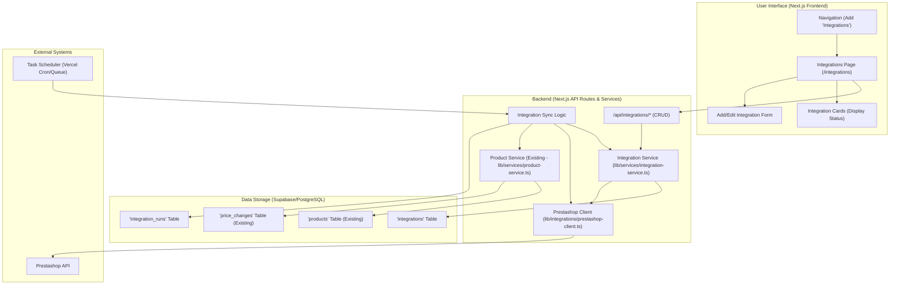

# Plan: E-commerce Integration Feature (Prestashop Focus)

**Version:** 1.0
**Date:** 2025-04-02

**Goal:** Implement a system for integrating with e-commerce platforms to automatically sync product and price data. This initial phase focuses on building the core structure and implementing the Prestashop integration.

## 1. Overview

This feature will introduce a new "Integrations" section in the application. Users (admins initially) can configure connections to supported e-commerce platforms (starting with Prestashop). Once configured and active, the system will periodically fetch product/price data from the platform's API and update the corresponding products in the PriceTracker database.

## 2. High-Level Architecture

## 3. Database Schema Changes

We need new tables and modifications to existing tables to manage integration configurations, track sync runs, and record price changes originating from integrations.

**New Tables:**

1.  **`integrations` Table:** Stores configuration for each integration instance.
    *   `id` (UUID, PK)
    *   `user_id` (UUID, FK to `auth.users`)
    *   `platform` (TEXT, e.g., 'prestashop', 'shopify') - *Indexed*
    *   `name` (TEXT, User-defined name for the integration)
    *   `api_url` (TEXT, Base URL for the platform's API)
    *   `api_key` (TEXT, Encrypted API key/token) - *Consider encryption*
    *   `status` (TEXT, e.g., 'pending_setup', 'active', 'inactive', 'error') - *Indexed*
    *   `last_sync_at` (TIMESTAMP WITH TIME ZONE)
    *   `last_sync_status` (TEXT, e.g., 'success', 'failed')
    *   `sync_frequency` (TEXT, e.g., 'daily', 'hourly') - *Or store as interval/cron string*
    *   `configuration` (JSONB, For platform-specific settings)
    *   `created_at` (TIMESTAMP WITH TIME ZONE)
    *   `updated_at` (TIMESTAMP WITH TIME ZONE)

2.  **`integration_runs` Table:** Logs the execution history of sync jobs (similar to `scraper_runs`).
    *   `id` (UUID, PK)
    *   `integration_id` (UUID, FK to `integrations`) - *Indexed*
    *   `user_id` (UUID, FK to `auth.users`)
    *   `status` (TEXT, e.g., 'started', 'processing', 'completed', 'failed')
    *   `started_at` (TIMESTAMP WITH TIME ZONE)
    *   `completed_at` (TIMESTAMP WITH TIME ZONE)
    *   `products_processed` (INTEGER)
    *   `products_updated` (INTEGER)
    *   `products_created` (INTEGER)
    *   `error_message` (TEXT)
    *   `log_details` (JSONB, Optional detailed logs)

**Modified Tables:**

1.  **`price_changes` Table:** Add a column to link changes originating from an integration.
    *   Add `integration_id` (UUID, NULLABLE, FK to `integrations`) - *Indexed*
    *   *Note:* When logging a price change from an integration, `integration_id` will be populated, and `competitor_id` might be NULL or set to a specific value indicating "own store". This needs final decision during implementation.

**Schema Update Process:**

*   Create a new SQL migration script (e.g., `scripts/migration-XXX-add-integrations.sql`).
*   Define the `CREATE TABLE` statements for `integrations` and `integration_runs`.
*   Define the `ALTER TABLE` statement for `price_changes` to add `integration_id`.
*   Add necessary indexes.
*   Update `scripts/database-README.md`.

## 4. Backend Development

**API Routes (`src/app/api/integrations/`)**

*   `POST /`: Create a new integration configuration.
*   `GET /`: List all integrations for the user.
*   `GET /{id}`: Get details of a specific integration.
*   `PUT /{id}`: Update an integration configuration (API keys, status, etc.).
*   `DELETE /{id}`: Delete an integration.
*   `POST /{id}/sync`: Manually trigger a sync (for testing/admin).

**Services (`src/lib/services/`)**

1.  **`integration-service.ts`:**
    *   Handles CRUD operations for the `integrations` table.
    *   Validates API credentials (potentially by making a test call via the platform client).
    *   Manages status updates (`active`, `inactive`, `error`).
    *   Retrieves configurations needed for sync jobs.
    *   Handles encryption/decryption of sensitive fields like `api_key`.

2.  **`integration-sync-service.ts` (or similar):**
    *   Orchestrates the sync process.
    *   Logs run details to `integration_runs`.
    *   Fetches data using the appropriate platform client (e.g., Prestashop).
    *   Processes fetched data (mapping fields, basic validation).
    *   Calls `product-service.ts` to update/create products and record price changes.
    *   Handles error reporting and updates `integrations.last_sync_status`.

**Platform Clients (`src/lib/integrations/`)**

1.  **`prestashop-client.ts`:**
    *   Contains functions to interact specifically with the Prestashop Webservices API.
    *   Handles authentication (using API key).
    *   Fetches product lists (including details like name, SKU, EAN, price, stock).
    *   Handles API pagination and error responses.

**Product Service (`src/lib/services/product-service.ts`)**

*   **Adaptation Needed:** Modify or add functions to handle product updates originating from integrations.
    *   The core matching logic (EAN > Brand+SKU) can likely be reused.
    *   **Pricing Logic:**
        *   When a matched product is found, the price fetched from the integration (e.g., Prestashop) will directly update the `products.our_price` field.
        *   Simultaneously, this price change must be recorded in the `price_changes` table. This requires comparing the fetched price with the *current* `products.our_price` before the update.
        *   A mechanism is needed to identify these "own store" price changes within the `price_changes` table. This requires adding the nullable `integration_id` (FK to `integrations`) column (see Database Schema Changes). When logging the change, `integration_id` will be populated.
        *   The `products.cost_price` field will remain unaffected by this integration process.

## 5. Frontend Development

**Navigation:**

*   Add an "Integrations" link to the main sidebar/navigation component (`src/components/layout/`).

**Page (`src/app/(app)/integrations/page.tsx`)**

*   Fetch and display the list of integrations using `IntegrationCard` components.
*   Provide a button/action to add a new integration, linking to a form/modal.
*   Implement logic for different views (admin vs. regular user) if needed in the future. For now, assume an admin-like view.

**Components (`src/components/integrations/`)**

1.  **`IntegrationCard.tsx`:**
    *   Displays integration details: Platform logo, name, status (Active, Inactive, Pending, Error), last sync time/status.
    *   Provides actions: Edit, Delete, Trigger Sync (optional).
2.  **`IntegrationForm.tsx`:**
    *   Form for creating/editing integrations.
    *   Fields: Platform selection (dropdown, initially just Prestashop), Name, API URL, API Key.
    *   Handles form submission, calling the backend API.
    *   Includes validation for required fields.

## 6. Sync Scheduling & Execution

*   **Mechanism:** Use Vercel Cron Jobs for scheduled execution.
*   **Job Definition:** Define a cron job (e.g., daily) that triggers an API endpoint (e.g., `/api/cron/sync-integrations`).
*   **Endpoint Logic (`/api/cron/sync-integrations`):**
    *   Fetches all `active` integrations scheduled to run.
    *   For each integration, trigger the sync process (potentially asynchronously using Vercel Queues if syncs are long-running, similar to the scraper plan).
    *   The sync logic resides within `integration-sync-service.ts`.

## 7. Implementation Steps (Task Breakdown)

1.  **DB:** Create migration script for `integrations` and `integration_runs` tables. Apply to DB.
2.  **Backend:** Implement `integration-service.ts` (CRUD, validation).
3.  **Backend:** Implement API routes (`/api/integrations/*`).
4.  **Backend:** Implement `prestashop-client.ts` (API interaction).
5.  **Backend:** Adapt `product-service.ts` for integration updates.
6.  **Backend:** Implement `integration-sync-service.ts` (orchestration, logging).
7.  **Frontend:** Add "Integrations" to navigation.
8.  **Frontend:** Create `IntegrationCard.tsx` component.
9.  **Frontend:** Create `IntegrationForm.tsx` component.
10. **Frontend:** Create the main Integrations page (`/integrations/page.tsx`).
11. **Scheduling:** Define Vercel Cron Job and create the trigger endpoint (`/api/cron/sync-integrations`).
12. **Testing:** Implement unit/integration tests for services and API routes. Test Prestashop connection and data fetching. Test end-to-end flow.
13. **Docs:** Update `TASK.md`, `README.md`, `PLANNING.md`.

## 8. Future Considerations

*   **Error Handling & Retries:** Implement robust error handling and retry mechanisms for API calls and sync jobs.
*   **Security:** Ensure secure storage of API keys (encryption at rest, potentially using a dedicated secrets manager). Implement proper authorization for API routes.
*   **Scalability:** Use Vercel Queues for handling sync jobs asynchronously if they become resource-intensive or numerous.
*   **UI/UX:** Improve user feedback during sync processes (real-time updates?). Add more detailed logging views.
*   **Other Platforms:** Design services and clients modularly to easily add support for other platforms (Shopify, WooCommerce, etc.).
*   **Configuration Granularity:** Allow users to configure specific data points to sync (e.g., only prices, only stock levels).