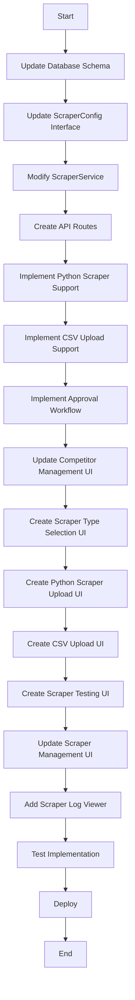
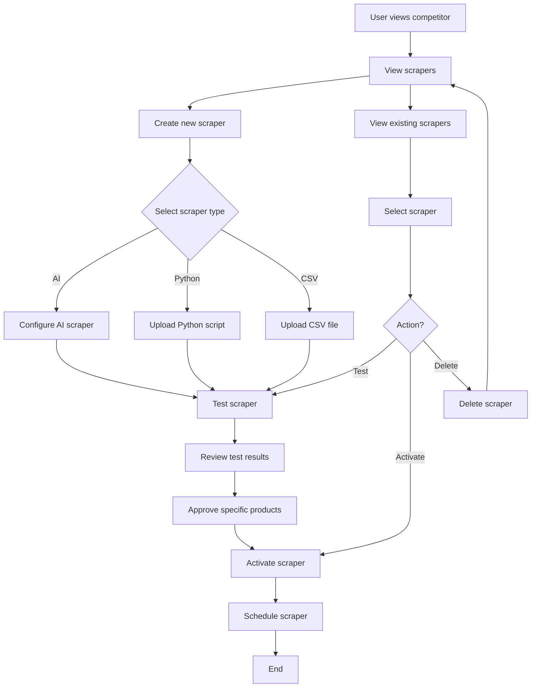

# Implementation Plan for Scraping Improvements

## Overview

Based on the requirements in the TODO.md file and additional feedback, we need to implement the following improvements to the scraping functionality:

1. Allow multiple scrapers per competitor, but only one active at a time
2. Add support for three types of scrapers:
   - AI-generated scrapers
   - Custom Python scrapers
   - CSV uploads for manual price data
3. Implement a testing and approval workflow for scrapers
4. Update the UI to support these new features

## 1. Database Changes

### 1.1 Update Scrapers Table

We need to modify the database schema to support multiple scraper types and enforce the one-active-scraper-per-competitor rule:

```sql
-- Add new columns to the scrapers table
ALTER TABLE scrapers 
ADD COLUMN scraper_type VARCHAR(20) NOT NULL DEFAULT 'ai',
ADD COLUMN python_script TEXT,
ADD COLUMN script_metadata JSONB,
ADD COLUMN is_approved BOOLEAN DEFAULT FALSE,
ADD COLUMN test_results JSONB,
ADD COLUMN approved_at TIMESTAMP WITH TIME ZONE;

-- Create a function to ensure only one active scraper per competitor
CREATE OR REPLACE FUNCTION ensure_one_active_scraper_per_competitor()
RETURNS TRIGGER AS $$
BEGIN
  -- If the new scraper is being set to active
  IF NEW.is_active = TRUE THEN
    -- Deactivate all other scrapers for this competitor
    UPDATE scrapers
    SET is_active = FALSE
    WHERE competitor_id = NEW.competitor_id
      AND id != NEW.id
      AND is_active = TRUE;
  END IF;
  RETURN NEW;
END;
$$ LANGUAGE plpgsql;

-- Create a trigger to enforce one active scraper per competitor
CREATE TRIGGER one_active_scraper_per_competitor
BEFORE INSERT OR UPDATE ON scrapers
FOR EACH ROW
EXECUTE FUNCTION ensure_one_active_scraper_per_competitor();
```

### 1.2 Create CSV Uploads Table

We need a new table to store CSV uploads:

```sql
-- Create a table for CSV uploads
CREATE TABLE csv_uploads (
  id UUID PRIMARY KEY DEFAULT gen_random_uuid(),
  user_id UUID REFERENCES auth.users(id) NOT NULL,
  competitor_id UUID REFERENCES competitors(id) NOT NULL,
  filename TEXT NOT NULL,
  file_content TEXT NOT NULL,
  uploaded_at TIMESTAMP WITH TIME ZONE DEFAULT NOW(),
  processed BOOLEAN DEFAULT FALSE,
  processed_at TIMESTAMP WITH TIME ZONE,
  error_message TEXT
);

-- Set up Row Level Security
ALTER TABLE csv_uploads ENABLE ROW LEVEL SECURITY;

-- Create policy for users to view their own CSV uploads
CREATE POLICY "Users can view their own CSV uploads"
  ON csv_uploads
  FOR SELECT
  USING (auth.uid() = user_id);

-- Create policy for users to insert their own CSV uploads
CREATE POLICY "Users can insert their own CSV uploads"
  ON csv_uploads
  FOR INSERT
  WITH CHECK (auth.uid() = user_id);

-- Create policy for users to update their own CSV uploads
CREATE POLICY "Users can update their own CSV uploads"
  ON csv_uploads
  FOR UPDATE
  USING (auth.uid() = user_id);

-- Create policy for users to delete their own CSV uploads
CREATE POLICY "Users can delete their own CSV uploads"
  ON csv_uploads
  FOR DELETE
  USING (auth.uid() = user_id);
```

## 2. Backend Implementation

### 2.1 Update Scraper Service

Modify the `ScraperService` class to support multiple scraper types and the approval workflow:

1. Update the `ScraperConfig` interface to include new fields:
   ```typescript
   export interface ScraperConfig {
     id?: string;
     user_id: string;
     competitor_id: string;
     name: string;
     url: string;
     scraper_type: 'ai' | 'python' | 'csv';
     selectors?: {
       product: string;
       name: string;
       price: string;
       image?: string;
       sku?: string;
       brand?: string;
       ean?: string;
     };
     schedule: {
       frequency: 'daily' | 'weekly' | 'monthly';
       time?: string; // HH:MM format
       day?: number; // Day of week (0-6) or day of month (1-31)
     };
     is_active: boolean;
     is_approved: boolean;
     python_script?: string;
     script_metadata?: {
       name: string;
       description: string;
       version: string;
       author: string;
       target_url: string;
       required_libraries: string[];
     };
     test_results?: any;
     approved_at?: string;
     created_at?: string;
     updated_at?: string;
     last_run?: string;
     status?: 'idle' | 'running' | 'success' | 'failed';
     error_message?: string;
   }
   ```

2. Add methods for different scraper types:
   - `createAIScraper`: Create an AI-generated scraper
   - `createPythonScraper`: Create a Python scraper
   - `createCSVScraper`: Create a CSV-based scraper
   - `validatePythonScraper`: Validate a Python scraper script
   - `testScraper`: Test a scraper and store results
   - `approveScraper`: Approve a scraper after testing
   - `activateScraper`: Activate a scraper (deactivating others for the same competitor)

3. Update the scraper execution logic:
   - Add support for running Python scrapers
   - Add support for processing CSV data
   - Implement the product matching logic with EAN or Brand+SKU
   - Ignore products without sufficient identification data

### 2.2 Create API Routes for New Scraper Types

1. Create API routes for Python scrapers:
   - `POST /api/scrapers/python`: Upload a Python scraper script
   - `POST /api/scrapers/python/validate`: Validate a Python scraper script

2. Create API routes for CSV uploads:
   - `POST /api/scrapers/csv`: Upload a CSV file
   - `GET /api/scrapers/csv/template`: Download a CSV template

3. Create API routes for the approval workflow:
   - `POST /api/scrapers/[scraperId]/test`: Test a scraper
   - `POST /api/scrapers/[scraperId]/approve`: Approve a scraper
   - `POST /api/scrapers/[scraperId]/activate`: Activate a scraper

### 2.3 Implement Python Scraper Execution Environment

1. Create a secure execution environment for running Python scrapers:
   - Use a sandboxed environment to prevent malicious code execution
   - Implement resource limits (CPU, memory, execution time)
   - Restrict access to sensitive system resources

2. Implement a Python script runner:
   - Parse the Python script
   - Execute the script in the sandboxed environment
   - Capture and process the results

### 2.4 Implement CSV Processing

1. Create a CSV parser:
   - Validate CSV format and required columns
   - Convert CSV data to the ScrapedProduct format
   - Handle different CSV formats and delimiters

2. Create a CSV template generator:
   - Generate a CSV template with the required columns
   - Include example data and instructions

## 3. Frontend Implementation

### 3.1 Update Competitor Management UI

1. Modify the competitor detail page to show all scrapers for the competitor
2. Highlight the active scraper
3. Add a section for scraper management with three options:
   - "Build with AI": Generate a scraper using AI
   - "Upload Python Scraper": Upload a custom Python scraper
   - "Upload CSV": Upload a CSV file with price data

### 3.2 Create Scraper Type Selection UI

1. Create a new component for selecting the scraper type:
   - Radio buttons or tabs for the three scraper types
   - Description of each scraper type
   - Next button to proceed to the specific scraper form

### 3.3 Create Python Scraper Upload UI

1. Create a new component for uploading Python scrapers:
   - File upload for .py files
   - Code editor for pasting Python code
   - Validation feedback
   - Test button to validate the scraper

### 3.4 Create CSV Upload UI

1. Create a new component for uploading CSV files:
   - File upload for CSV files
   - Download template button
   - Preview of the CSV data
   - Mapping options for columns

### 3.5 Create Scraper Testing UI

1. Create a new component for testing scrapers:
   - Input field for test URL
   - Run button to test the scraper
   - Results display with product data
   - Approval checkboxes for individual products
   - Submit button to approve the scraper

### 3.6 Update Scraper Management UI

1. Create a new component for managing scrapers:
   - List of all scrapers for a competitor
   - Status indicators (active, approved, etc.)
   - Action buttons (test, approve, activate, delete)
   - Performance metrics (success rate, speed, etc.)

### 3.7 Add Scraper Log Viewer

1. Create a new component for viewing scraper logs:
   - Display execution logs
   - Filter options (date, status, etc.)
   - Error highlighting

## 4. Implementation Steps

### Phase 1: Database and Backend Changes

1. Update the database schema
2. Update the `ScraperConfig` interface
3. Modify the `ScraperService` class to support multiple scraper types
4. Create API routes for the new scraper types

### Phase 2: Python Scraper Support

1. Implement the Python scraper validation logic
2. Create the Python scraper execution environment
3. Create API routes for Python scrapers

### Phase 3: CSV Upload Support

1. Implement the CSV parser
2. Create the CSV template generator
3. Create API routes for CSV uploads

### Phase 4: Approval Workflow

1. Implement the scraper testing logic
2. Implement the approval workflow
3. Create API routes for the approval workflow

### Phase 5: Frontend Changes

1. Update the competitor management UI
2. Create the scraper type selection UI
3. Create the Python scraper upload UI
4. Create the CSV upload UI
5. Create the scraper testing UI
6. Update the scraper management UI
7. Add the scraper log viewer

## 5. Testing Plan

1. Test multiple scrapers per competitor:
   - Create multiple scrapers for a competitor
   - Activate one scraper
   - Verify that other scrapers are deactivated

2. Test different scraper types:
   - Create an AI-generated scraper
   - Create a Python scraper
   - Create a CSV-based scraper
   - Verify that each type works correctly

3. Test the approval workflow:
   - Test a scraper
   - Approve specific products
   - Activate the scraper
   - Verify that the scraper runs correctly

4. Test product matching:
   - Create products with EAN codes
   - Create products with Brand+SKU combinations
   - Run scrapers that match these products
   - Verify that products are correctly matched
   - Verify that products without EAN or Brand+SKU are ignored

5. Test the UI:
   - Verify that the competitor management UI shows all scrapers
   - Verify that the scraper type selection UI works correctly
   - Verify that the Python scraper upload UI works correctly
   - Verify that the CSV upload UI works correctly
   - Verify that the scraper testing UI shows results correctly
   - Verify that the scraper management UI works correctly
   - Verify that the scraper log viewer shows logs correctly

## 6. Security Considerations

1. Python Script Validation:
   - Validate Python scripts for security issues
   - Restrict access to sensitive system resources
   - Implement resource limits

2. Sandboxed Execution:
   - Run Python scripts in a sandboxed environment
   - Prevent access to the file system, network, etc.
   - Implement timeouts to prevent infinite loops

3. CSV Validation:
   - Validate CSV files for security issues
   - Implement size limits
   - Sanitize CSV data to prevent injection attacks

4. Input Validation:
   - Validate all user inputs
   - Sanitize Python scripts to prevent code injection
   - Implement rate limiting for API endpoints

## 7. Mermaid Diagram of Implementation Flow



## 8. Mermaid Diagram of User Flow



## 9. CSV Template Format

The CSV template for manual price data will have the following columns:

```csv
name,price,currency,url,image_url,sku,brand,ean
"Example Product 1",19.99,USD,https://example.com/product1,https://example.com/images/product1.jpg,PROD001,Example Brand,1234567890123
"Example Product 2",29.99,USD,https://example.com/product2,https://example.com/images/product2.jpg,PROD002,Example Brand,2345678901234
```

Required columns:
- `name`: Product name
- `price`: Product price (numeric)

Optional columns:
- `currency`: Currency code (default: USD)
- `url`: URL to the product page
- `image_url`: URL to the product image
- `sku`: Product SKU/code
- `brand`: Product brand
- `ean`: Product EAN/barcode

At least one of the following must be provided for product matching:
- `ean`: EAN/barcode
- Both `brand` and `sku`: Brand and SKU combination

## 10. Python Scraper Template

The Python scraper template will be the same as the one already defined in the TODO.md file, with additional validation to ensure that products have either an EAN or Brand+SKU combination:

```python
# pricetracker_scraper_template.py

"""
PriceTracker Python Scraper Template

This template provides the structure for creating custom Python scrapers
for the PriceTracker application. Implement the required functions below
to create a working scraper that can be uploaded to the application.
"""

import json
from typing import Dict, List, Optional, Any

# Configuration (will be populated by the system)
COMPETITOR_ID = "{{competitor_id}}"
USER_ID = "{{user_id}}"

def get_metadata() -> Dict[str, Any]:
    """
    Return metadata about this scraper.
    
    This function is required and will be called when the scraper is uploaded.
    """
    return {
        "name": "My Custom Scraper",  # Change this to your scraper name
        "description": "Scrapes product data from example.com",  # Brief description
        "version": "1.0.0",
        "author": "Your Name",
        "target_url": "https://example.com/products",  # The main URL this scraper targets
        "required_libraries": [  # List any third-party libraries your scraper needs
            "requests",
            "beautifulsoup4"
        ]
    }

def scrape() -> List[Dict[str, Any]]:
    """
    Main scraping function. Implement your scraping logic here.
    
    Returns:
        A list of dictionaries, each representing a scraped product with the following fields:
        - name (required): Product name
        - price (required): Product price as a float
        - currency (optional): Currency code (default: USD)
        - url (optional): URL to the product page
        - image_url (optional): URL to the product image
        - sku (optional): Product SKU/code from the competitor
        - brand (optional): Product brand
        - ean (optional): Product EAN/barcode
        
    Note: Each product must have either an EAN or both Brand and SKU for matching.
    Products without sufficient identification will be ignored.
    """
    # Implement your scraping logic here
    # Example:
    scraped_products = [
        {
            "name": "Example Product 1",
            "price": 19.99,
            "currency": "USD",
            "url": "https://example.com/product1",
            "image_url": "https://example.com/images/product1.jpg",
            "sku": "PROD001",
            "brand": "Example Brand",
            "ean": "1234567890123"
        },
        # Add more products as needed
    ]
    
    # Filter out products without sufficient identification
    valid_products = []
    for product in scraped_products:
        if product.get("ean") or (product.get("brand") and product.get("sku")):
            valid_products.append(product)
    
    return valid_products

def test(url: str) -> List[Dict[str, Any]]:
    """
    Test function that will be called when testing the scraper.
    
    Args:
        url: A specific URL to test the scraper on
        
    Returns:
        Same format as the scrape() function
    """
    # Implement test logic here, usually a simplified version of scrape()
    # that works on a single page
    
    # Example:
    products = [
        {
            "name": "Test Product",
            "price": 29.99,
            "currency": "USD",
            "url": url,
            "image_url": "https://example.com/images/test.jpg",
            "sku": "TEST001",
            "brand": "Test Brand",
            "ean": "1234567890123"
        }
    ]
    
    # Filter out products without sufficient identification
    valid_products = []
    for product in products:
        if product.get("ean") or (product.get("brand") and product.get("sku")):
            valid_products.append(product)
    
    return valid_products

# Don't modify this section - it's used by the application to run the scraper
if __name__ == "__main__":
    import sys
    
    if len(sys.argv) > 1:
        command = sys.argv[1]
        if command == "metadata":
            print(json.dumps(get_metadata()))
        elif command == "test" and len(sys.argv) > 2:
            test_url = sys.argv[2]
            print(json.dumps(test(test_url)))
        elif command == "scrape":
            print(json.dumps(scrape()))
        else:
            print(json.dumps({"error": "Invalid command"}))
    else:
        print(json.dumps({"error": "No command provided"}))